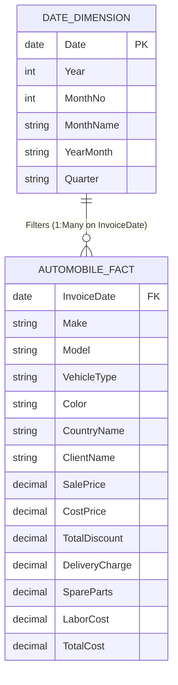

# 🚗 Global Luxury Automobile Sales & Profitability Analytics

[](https://powerbi.microsoft.com/)
[](https://learn.microsoft.com/en-us/dax/)
[](https://learn.microsoft.com/en-us/power-query/)
[](https://opensource.org/licenses/MIT)

> **Comprehensive Enterprise Business Intelligence Dashboard & Case Study** evaluating **457 transactions**, **$31.70M in luxury vehicle revenue**, **$10.24M net profit**, and **32.3% operating margin** across 7 marquee European automobile brands and 6 international markets (2012–2015).

---

## 📌 Executive Summary & Financial KPIs

| Metric Dimension | Value | Business Significance |
| :--- | :--- | :--- |
| **Total Gross Revenue** | **$31.697M** | Four-year multi-brand vehicle sales volume |
| **Total Net Revenue** | **$31.473M** | Sales after promotional discount discipline ($225k total) |
| **Total Operating Cost** | **$21.455M** | Direct acquisition + delivery + spare parts + labor |
| **Net Operating Profit** | **$10.243M** | **32.3% Overall Net Margin** across all brand lines |
| **Volume Invoiced** | **457 Cars** | Multi-year surge (+479% from 2012 to 2015) |
| **Client Portfolio** | **31 Clients** | High-Net-Worth VIP & Corporate Accounts ($1.02M LTV) |
| **Top Performing Brand** | **Aston Martin** | **$10.69M Revenue (33.7%)** | **$3.7M Profit** |
| **Top Performing Model** | **Aston Martin DB9** | **$5.42M Revenue** (#1 Model across 27 lines) |
| **Primary Geographic Hubs** | **UK & USA** | **86.38% Global Revenue Share** ($27.38M) |

---

## 🏗️ Data Architecture & Star Schema Model

The BI solution employs a dedicated **Star Schema** data architecture separating transactional facts from temporal dimensions:



---

## 🌟 Interactive Dashboard Suite

### 1. Executive Sales & KPI Overview (Page 1)
*Real-time executive cockpit tracking overall volume, trajectory trendlines, budget target gauges, brand rankings, and body style mix.*


---

### 2. Financial Performance & Profitability (Page 2)
*Diagnostic margin analysis, profit contribution waterfall breakdown, model-level profitability scatter plot, and bimodal vehicle pricing histogram.*


---

### 3. Regional & Geographic Market Analysis (Page 3)
*Global geographic mapping, country revenue contribution donut, stacked brand-by-market distribution bars, and multidimensional sales intensity heatmaps.*


---

## 🧮 Complete DAX Measure Library (Task 1)

### 1. Core Revenue & Profit Measures
```dax
-- Total Gross Sales
Total Sales = SUM(Automobile[SalePrice])

-- Total Operating Cost
Total Cost = SUM(Automobile[TotalCost])

-- Net Operating Profit
Total Profit = [Total Sales] - [Total Cost]

-- Net Profit Margin %
Profit Margin % = DIVIDE([Total Profit], [Total Sales], 0)
```

### 2. Time Intelligence & Trajectory
```dax
-- Year-to-Date Sales
YTD Sales = TOTALYTD([Total Sales], 'Date'[Date])

-- YoY Sales Growth %
Sales Prior Year = CALCULATE([Total Sales], SAMEPERIODLASTYEAR('Date'[Date]))
Sales Growth YoY % = 
VAR Prior = [Sales Prior Year]
RETURN
DIVIDE([Total Sales] - Prior, Prior, 0)

-- Trailing 12 Months (LTM)
Sales Last 12 Months = 
CALCULATE(
    [Total Sales],
    DATESINPERIOD('Date'[Date], MAX('Date'[Date]), -12, MONTH)
)

-- 3-Month Rolling Moving Average
3-Month Moving Avg Sales = 
AVERAGEX(
    DATESINPERIOD('Date'[Date], MAX('Date'[Date]), -3, MONTH),
    [Total Sales]
)
```

### 3. Advanced Ranking & Customer Metrics
```dax
-- Top 5 Selling Models
Top 5 Models Sales = 
CALCULATE(
    [Total Sales],
    KEEPFILTERS(TOPN(5, ALL(Automobile[Model]), [Total Sales], DESC))
)

-- Model Sales Rank
Product Sales Rank = 
RANKX(
    ALL(Automobile[Model]),
    [Total Sales],
    ,
    DESC,
    Dense
)

-- Customer Lifetime Value
Avg Sales per Customer = 
DIVIDE([Total Sales], DISTINCTCOUNT(Automobile[ClientName]), 0)
```

---

## 🛠️ Power Query ETL & M-Code Recipes (Task 2)

| Requirement | Power Query M Formula |
| :--- | :--- |
| **TotalCost Custom Column** | `Table.AddColumn(Source, "TotalCost", each [CostPrice] + [DeliveryCharge] + [SpareParts] + [LaborCost], Currency.Type)` |
| **Filter Jaguar Records** | `Table.SelectRows(Source, each ([Make] = "Jaguar"))` |
| **Replace Coupe with Convertible** | `Table.ReplaceValue(Source, "Coupe", "Convertible", Replacer.ReplaceText, {"VehicleType"})` |
| **Extract InvoiceYear & Month** | `Table.AddColumn(Source, "InvoiceYear", each Date.Year([InvoiceDate]), Int64.Type)` |
| **Group By Make & Country** | `Table.Group(Source, {"Make", "CountryName"}, {{"Total Sales", each List.Sum([SalePrice]), type number}})` |
| **Sort Descending on SalePrice** | `Table.Sort(Source, {{"SalePrice", Order.Descending}})` |
| **Merge Client Dimension** | `Table.NestedJoin(Source, {"ClientName"}, ClientTable, {"ClientName"}, "ClientDetails", JoinKind.LeftOuter)` |
| **Remove Key Duplicates** | `Table.Distinct(Source, {"InvoiceDate", "Make"})` |
| **Pivot Color Column** | `Table.Pivot(Source, List.Distinct(Source[Color]), "Color", "SalePrice", List.Sum)` |

---

## 📈 Strategic Case Study Takeaways

```
+-----------------------------------------------------------------------------+
|                            STRATEGIC ROADMAP                                |
+-----------------------------------------------------------------------------+
| 1. TVR TURNAROUND         | Restructure technician labor rates to eliminate |
|                           | the -$0.1M operating loss on TVR models.        |
+---------------------------+-------------------------------------------------+
| 2. MARQUEE SUPPLY PRIORITY| Guarantee 45-day buffer inventory for cash cow  |
|                           | models: Aston Martin DB9 & Rolls Royce Camargue.|
+---------------------------+-------------------------------------------------+
| 3. EUROPEAN EXPANSION     | Establish certified distributor hubs in Madrid  |
|                           | and Frankfurt to capture untapped EU luxury.    |
+---------------------------+-------------------------------------------------+
| 4. VIP CONCIERGE PROGRAM  | Implement bespoke loyalty & white-glove service |
|                           | for the 31 core accounts ($1.02M LTV).          |
+-----------------------------------------------------------------------------+
```

---

## 📁 Repository Structure

```text
├── Automobile Dashboard.pbix                 # Complete Power BI Desktop Report (3 Pages)
├── Automobile Dataset.xlsx                    # Raw transactional dataset (457 rows, 16 cols)
├── Automobile Problem Statement.pdf           # Assignment brief & technical tasks
├── Automobile_Sales_Analytics_Report.docx     # Comprehensive Case Study Word Report
├── Automobile_Sales_Executive_Presentation.pptx # Executive 16:9 PowerPoint Presentation
├── REPORT.md                                  # Full Markdown Case Study Report
├── README.md                                  # Project overview and documentation
└── screenshots/                               # High-resolution dashboard captures
    ├── page1_executive_overview.png
    ├── page2_financial_performance.png
    ├── page3_regional_analysis.png
    ├── task2_groupby_make_country.png
    └── task2_remove_duplicates.png
```

---

## 💻 Setup & How to Run
1. Clone or download this repository.
2. Open `Automobile Dashboard.pbix` in **Microsoft Power BI Desktop** (latest version recommended).
3. If dataset file path prompt appears, point the source to `Automobile Dataset.xlsx`.
4. Review the full technical case study in `Automobile_Sales_Analytics_Report.docx` or `REPORT.md`.

---
*Created as part of the Advanced Business Intelligence & Analytics Portfolio.*
