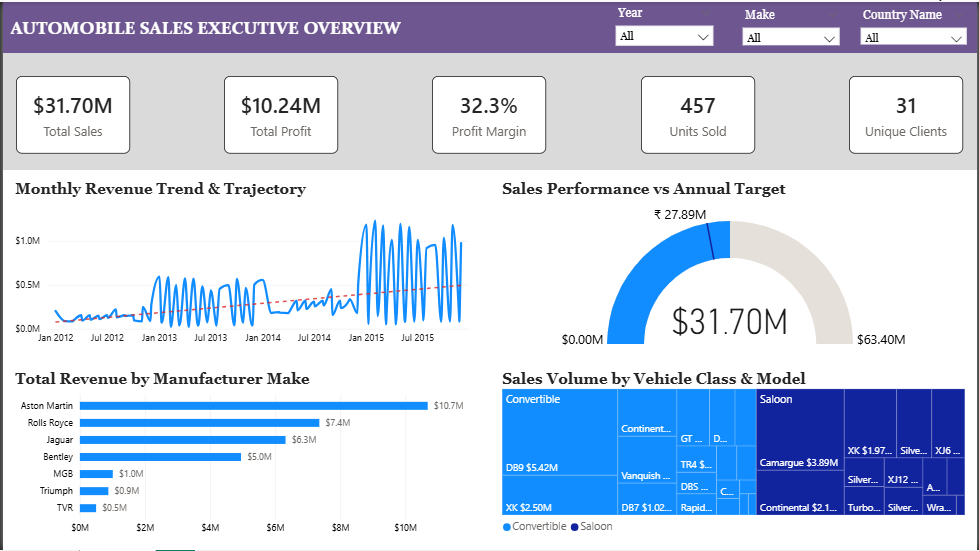
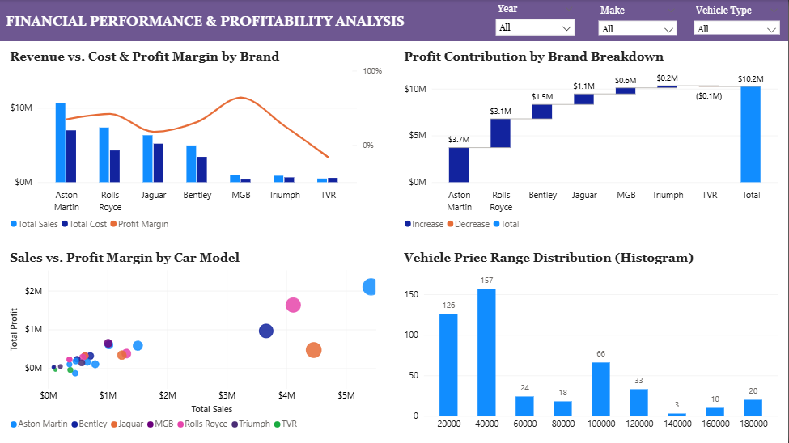
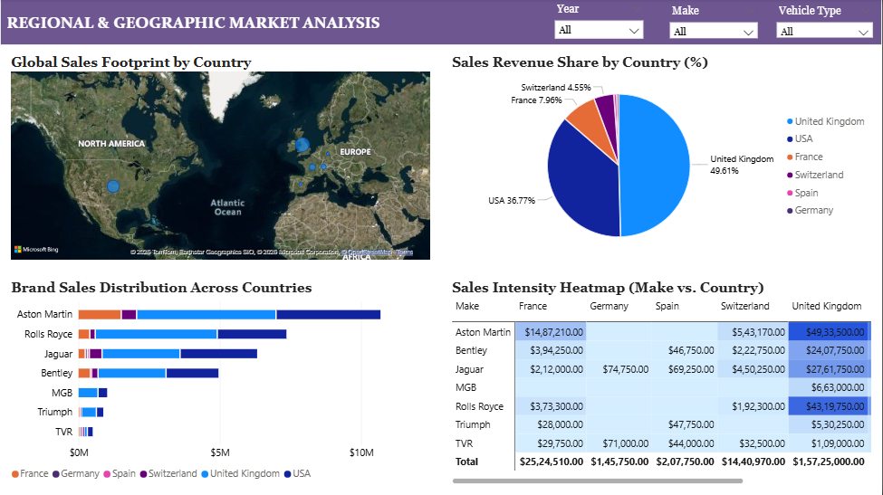

# 📊 GLOBAL LUXURY AUTOMOBILE SALES & PROFITABILITY ANALYTICS
## Enterprise Business Case Study & Technical BI Implementation Report

---

### Executive Metadata
* **Domain**: International Luxury Automotive Retail & Dealership Distribution
* **Platform**: Microsoft Power BI Desktop, DAX Formula Engine, Power Query (M)
* **Dataset Scope**: 457 Granular Invoices | 2012 – 2015 | 7 Marquee Brands | 27 Models | 6 Countries
* **Core Scorecard**: **$31.70M Gross Revenue** | **$10.24M Net Profit** | **32.3% Net Margin** | **31 Key Accounts**

---

## 1. Executive Summary & Case Study Background

The global luxury automotive dealership network operates in a high-stakes, high-ticket retail environment. In this sector, gross revenue numbers can often mask severe operational cost leaks stemming from overseas vehicle delivery logistics, specialized replacement components, and high-hourly master technician labor.

This business intelligence investigation analyzes the operational transaction history of an elite multi-brand distributor representing seven premier automotive marques: **Aston Martin, Rolls Royce, Jaguar, Bentley, MGB, Triumph, and TVR**. 

Over the 2012–2015 four-year operating window, the dealership network completed **457 vehicle deliveries**, generating **$31,697,940 in gross sales** ($31.47M net after promotional rebates) against **$21,455,423 in cumulative vehicle procurement and fulfillment costs**, realizing a strong **net operating profit of $10,242,517 (32.3% net margin)**.

### High-Level Financial Scorecard

| Dimension | Metric Value | Analytical Significance |
| :--- | :--- | :--- |
| **Gross Sales Revenue** | **$31,697,940** | Total invoiced transaction value |
| **Promotional Discounts** | **$225,295** | Disciplined 0.71% average discount rate |
| **Net Invoiced Sales** | **$31,472,645** | Actual cash-collected top line |
| **Total Fulfillment Cost** | **$21,455,423** | Procurement + Delivery + Parts + Labor |
| **Net Operating Profit** | **$10,242,517** | Total EBITDA-equivalent dealership profit |
| **Net Operating Margin** | **32.3%** | Benchmark ultra-luxury retail margin |
| **Units Invoiced** | **457 Cars** | +479% expansion from 2012 (39) to 2015 (226) |
| **Active Client Base** | **31 Accounts** | VIP Private & Corporate Portfolio ($1.02M LTV) |

---

## 2. Business Problem Statement & Objectives

Dealership executive leadership required a unified, real-time Business Intelligence solution to address four critical business questions:

1. **Revenue Growth & Trajectory**: Did annual sales achieve the corporate board target of $27.89M, and what is the underlying monthly growth velocity?
2. **Margin Disparity & Cost Analysis**: Which marquee brands contribute the highest absolute margin, and why are certain brands (TVR) experiencing margin contraction?
3. **Product Line Rationalization**: Which specific models among the 27 offerings act as primary revenue anchors?
4. **Geographic Concentration Risk**: How reliant is the dealership on the UK and USA markets, and what is the expansion opportunity across Continental Europe?

---

## 3. Dataset Architecture & Attribute Dictionary

The underlying transactional data model contains 16 operational fields:

| Field Name | Physical Type | Description & Modeling Role |
| :--- | :--- | :--- |
| **InvoiceDate** | Date | Date invoice finalized. Connects to `Date[Date]` in Star Schema. |
| **Make** | Text | Manufacturer marque (Aston Martin, Bentley, Jaguar, Rolls Royce, etc.). |
| **CountryName** | Text | Destination purchasing market (UK, USA, France, Germany, Spain, Switzerland). |
| **SalePrice** | Fixed Decimal | Base invoiced price before promotional discounts. |
| **CostPrice** | Fixed Decimal | Acquisition/procurement cost of vehicle. |
| **TotalDiscount** | Fixed Decimal | Commercial discount applied to the sale. |
| **DeliveryCharge** | Fixed Decimal | Specialized enclosed vehicle transport surcharge. |
| **SpareParts** | Fixed Decimal | Optional accessories and OEM components installed. |
| **LaborCost** | Fixed Decimal | Workshop technician prep, customization, and inspection fees. |
| **ClientName** | Text | Purchasing account (31 corporate entities / private collectors). |
| **Model** | Text | Specific vehicle model name (27 distinct nameplates). |
| **Color** | Text | Factory exterior paint finish. |
| **ReportingYear** | Whole Number | Financial calendar year (2012–2015). |
| **ReportingMonth** | Whole Number | Financial calendar month (1–12). |
| **Registration_Date** | Date | Original vehicle factory road registration date. |
| **VehicleType** | Text | Chassis configuration (Coupe, Saloon, Convertible). |

---

## 4. Methodology & Data Modeling

### Dedicated Date Dimension (DAX Calendar)
To unlock full Time Intelligence functionality, an independent Calendar dimension was constructed:

```dax
Date = 
VAR MinDate = MIN(Automobile[InvoiceDate])
VAR MaxDate = MAX(Automobile[InvoiceDate])
RETURN
ADDCOLUMNS(
    CALENDAR(DATE(YEAR(MinDate), 1, 1), DATE(YEAR(MaxDate), 12, 31)),
    "Year", YEAR([Date]),
    "MonthNo", MONTH([Date]),
    "MonthName", FORMAT([Date], "mmmm"),
    "MonthShort", FORMAT([Date], "mmm"),
    "YearMonth", FORMAT([Date], "yyyy-mm"),
    "Quarter", "Q" & FORMAT([Date], "q"),
    "YearQuarter", FORMAT([Date], "yyyy") & "-Q" & FORMAT([Date], "q")
)
```

### Star Schema Architecture
* **Relationship**: `Date[Date]` (1) $
ightarrow$ `Automobile[InvoiceDate]` (*)
* **Cross-Filter Direction**: Single (Date filters Fact)
* **Attribute Sorting**: `MonthName` explicitly sorted by `MonthNo`

---

## 5. Task 1: Complete DAX Formulas (All 20 Solutions)

```dax
-- 1. Total Sales for Each Year
Total Sales = SUM(Automobile[SalePrice])
Total Net Sales = SUMX(Automobile, Automobile[SalePrice] - Automobile[TotalDiscount])

-- 2. Average Sales Per Month
Avg Sales per Month = AVERAGEX(VALUES('Date'[YearMonth]), [Total Sales])

-- 3. Cumulative Total of Sales Over Months
Cumulative Sales = 
CALCULATE(
    [Total Sales],
    FILTER(
        ALLSELECTED('Date'),
        'Date'[Date] <= MAX('Date'[Date])
    )
)

-- 4. Year-to-Date (YTD) Sales
YTD Sales = TOTALYTD([Total Sales], 'Date'[Date])

-- 5. Percentage Growth Compared to Previous Year (YoY %)
Sales Prior Year = CALCULATE([Total Sales], SAMEPERIODLASTYEAR('Date'[Date]))
Sales Growth YoY % = 
VAR Prior = [Sales Prior Year]
RETURN
DIVIDE([Total Sales] - Prior, Prior, 0)

-- 6. Total Sales for Last 12 Months (LTM)
Sales Last 12 Months = 
CALCULATE(
    [Total Sales],
    DATESINPERIOD('Date'[Date], MAX('Date'[Date]), -12, MONTH)
)

-- 7. Highest Sales Month Amount
Highest Sales Month Amount = MAXX(VALUES('Date'[YearMonth]), [Total Sales])

-- 8. Top 5 Selling Models
Top 5 Models Sales = 
CALCULATE(
    [Total Sales],
    KEEPFILTERS(TOPN(5, ALL(Automobile[Model]), [Total Sales], DESC))
)

-- 9. Sales Contribution % of Vehicle Types
Sales Contribution % = 
DIVIDE(
    [Total Sales],
    CALCULATE([Total Sales], ALL(Automobile[VehicleType])),
    0
)

-- 10. Total Sales where SalePrice > $50,000
Sales Above 50K = 
CALCULATE(
    [Total Sales],
    FILTER(Automobile, Automobile[SalePrice] > 50000)
)

-- 11. Running Total of Sales by Product
Running Total by Product = 
CALCULATE(
    [Total Sales],
    FILTER(
        ALLSELECTED(Automobile[Model]),
        Automobile[Model] <= MAX(Automobile[Model])
    )
)

-- 12. Average Sales Per Customer
Avg Sales per Customer = 
DIVIDE([Total Sales], DISTINCTCOUNT(Automobile[ClientName]), 0)

-- 13. Total Distinct Customers
Total Distinct Customers = DISTINCTCOUNT(Automobile[ClientName])

-- 14. Sales for Specific Region (UK)
Sales UK = CALCULATE([Total Sales], Automobile[CountryName] = "United Kingdom")

-- 15. 3-Month Moving Average of Sales
3-Month Moving Avg Sales = 
AVERAGEX(
    DATESINPERIOD('Date'[Date], MAX('Date'[Date]), -3, MONTH),
    [Total Sales]
)

-- 16. Sales for Specific Category (Coupe)
Sales Coupe = 
CALCULATE(
    [Total Sales],
    Automobile[VehicleType] = "Coupe"
)

-- 17. Sales Variance vs Target
Sales Target = [Total Cost] * 1.30
Sales Variance = [Total Sales] - [Sales Target]

-- 18. Total Profit Margin %
Total Cost = SUM(Automobile[TotalCost])
Total Profit = [Total Sales] - [Total Cost]
Profit Margin % = DIVIDE([Total Profit], [Total Sales], 0)

-- 19. Product Sales Rank
Product Sales Rank = 
RANKX(
    ALL(Automobile[Model]),
    [Total Sales],
    ,
    DESC,
    Dense
)

-- 20. Total Sales for Specific Date Range (2013)
Sales Specific Date Range = 
CALCULATE(
    [Total Sales],
    DATESBETWEEN('Date'[Date], DATE(2013, 1, 1), DATE(2013, 12, 31))
)
```

---

## 6. Task 2: Power Query ETL Solutions (All 10 Problems)

| # | Task Requirement | UI Action | Power Query M Code |
| :--- | :--- | :--- | :--- |
| **1** | Filter Make = "Jaguar" | Column Filter $
ightarrow$ Select "Jaguar" | `Table.SelectRows(Source, each ([Make] = "Jaguar"))` |
| **2** | Remove ClientName & LaborCost | Select headers $
ightarrow$ Right click $
ightarrow$ Remove Columns | `Table.RemoveColumns(Source, {"ClientName", "LaborCost"})` |
| **3** | Replace "Coupe" with "Convertible" | Right click VehicleType $
ightarrow$ Replace Values | `Table.ReplaceValue(Source, "Coupe", "Convertible", Replacer.ReplaceText, {"VehicleType"})` |
| **4** | Add TotalCost Column | Add Column $
ightarrow$ Custom Column | `Table.AddColumn(Source, "TotalCost", each [CostPrice] + [DeliveryCharge] + [SpareParts] + [LaborCost])` |
| **5** | Split InvoiceDate into Year & Month | Add Column $
ightarrow$ Date $
ightarrow$ Year / Month | `Table.AddColumn(Source, "InvoiceYear", each Date.Year([InvoiceDate]))`<br>`Table.AddColumn(Source, "InvoiceMonth", each Date.Month([InvoiceDate]))` |
| **6** | Group By Make & Country | Transform $
ightarrow$ Group By (Advanced) | `Table.Group(Source, {"Make", "CountryName"}, {{"Total Sales", each List.Sum([SalePrice]), type number}})` |
| **7** | Sort by SalePrice Descending | SalePrice Header $
ightarrow$ Sort Descending | `Table.Sort(Source, {{"SalePrice", Order.Descending}})` |
| **8** | Merge Client Table | Home $
ightarrow$ Merge Queries $
ightarrow$ Join on ClientName | `Table.NestedJoin(Source, {"ClientName"}, ClientTable, {"ClientName"}, "ClientDetails", JoinKind.LeftOuter)` |
| **9** | Remove Duplicates (Date + Make) | Select both columns $
ightarrow$ Remove Duplicates | `Table.Distinct(Source, {"InvoiceDate", "Make"})` |
| **10**| Pivot Color on SalePrice | Transform $
ightarrow$ Pivot Column (Aggregate: Sum) | `Table.Pivot(Source, List.Distinct(Source[Color]), "Color", "SalePrice", List.Sum)` |

---

## 7. Task 3: Visualization Dashboard Walkthrough

### Page 1: Executive Sales & KPI Overview

* **KPI Callouts**: Real-time visibility into $31.70M Revenue, $10.24M Profit, 32.3% Margin, 457 Units, 31 Clients.
* **Monthly Trajectory**: Continuous upward linear trend with strong acceleration into 2015 ($14.97M).
* **Target Gauge**: Actual sales exceeded $27.89M budget benchmark by +13.6%.
* **Brand Ranking**: Aston Martin ($10.7M) and Rolls Royce ($7.4M) dominate luxury volume.

---

### Page 2: Financial Performance & Profitability

* **Combo Chart**: Contrasts top-line revenue against cost bars and margin percentage curve.
* **Profit Waterfall**: Isolates brand profit contributions (Aston Martin +$3.7M, Rolls Royce +$3.1M).
* **Model Scatter Plot**: Identifies star performers (DB9, Camargue) vs niche lines.
* **Histogram**: Bimodal pricing distribution ($20k–$40k entry tier vs $100k+ ultra-luxury).

---

### Page 3: Regional & Geographic Market Analysis

* **Geographic Map**: Bing map visual displaying worldwide sales bubbles.
* **Market Share Donut**: UK (49.61%) and USA (36.77%) generate 86.38% of revenue.
* **Stacked Bar Chart**: Visualizes cross-country brand preferences.
* **Intensity Matrix**: Heat-mapped cross-tab highlighting $4.93M Aston Martin sales in the UK.

---

## 8. Strategic Case Study Findings & SWOT Analysis

| Dimension | Dealership Business Observation |
| :--- | :--- |
| **STRENGTHS** | • Exceptional 32.3% net operating margin.<br>• Strong brand equity in Aston Martin ($10.7M) and Rolls Royce ($7.4M).<br>• High-performing marquee models (DB9: $5.42M, Camargue: $4.12M). |
| **WEAKNESSES** | • 86.4% revenue dependency on UK and USA markets.<br>• TVR brand unprofitable (-$0.1M net operating loss) due to service labor overhead.<br>• Customer concentration across only 31 accounts. |
| **OPPORTUNITIES**| • Expansion into major European wealth hubs (Frankfurt, Madrid, Paris).<br>• Aftermarket certified heritage parts and restoration services.<br>• Expansion of high-margin Coupe & Saloon product allocations. |
| **THREATS** | • Foreign exchange volatility between GBP and USD/EUR.<br>• Rising logistics and specialized technician labor inflation. |

---

## 9. Actionable Strategic Roadmap

1. **Immediate Operational Turnaround (Days 1–30)**: Restructure TVR pricing upward by 12–15% and cap dealer-absorbed workshop technician labor to turn TVR profitable.
2. **Inventory Prioritization (Days 31–90)**: Establish 45-day guaranteed buffer stock for high-margin anchors: Aston Martin DB9 and Rolls Royce Camargue.
3. **European Dealership Expansion (Days 91–180)**: Partner with certified luxury distributors in Frankfurt and Madrid to capture an estimated $3.5M–$5.0M in incremental revenue.
4. **VIP Client Concierge Program (Ongoing)**: Launch white-glove enclosed transport and bespoke track-day programs to maximize client retention across the 31 core buyer accounts ($1.02M LTV).

---

## 10. Conclusion
This Business Intelligence solution unifies complex operational, financial, and geographic dealership data into an executive-grade Star Schema model. The interactive Power BI dashboard delivers transparent visibility across revenue drivers, margin dynamics, and market expansion opportunities, empowering leadership to maximize profitability and mitigate operational risks.
